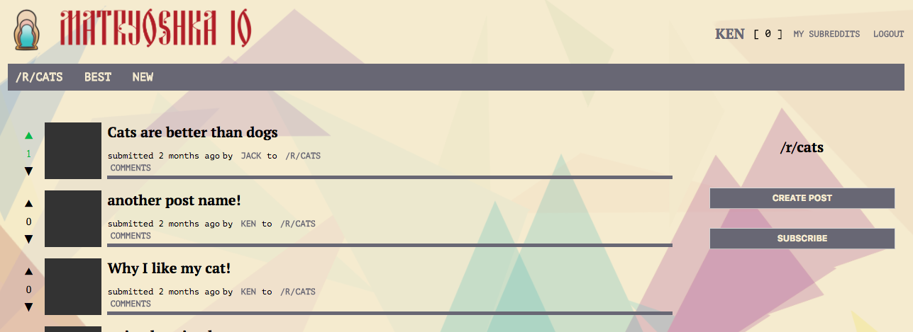
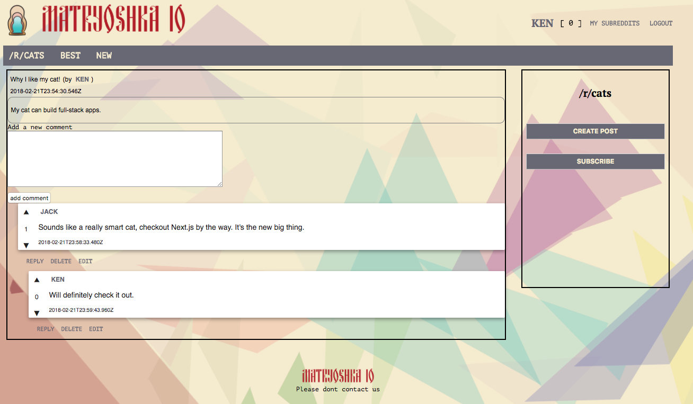

# Matryoshka
Russian-doll themed Reddit clone.

## Getting Started
Be sure to take care of the Prerequisites section first. Then run the following commands.

1. `yarn` (install dependencies)
2. `yarn seed` (inserts seed data)
3. `yarn dev` (boots up Next.js and REST server)

### Prerequisites

**MongoDB** Have an instance running on your machine on port `27017`.

## Testing

Please have a look at `testing/README.md`.

## Deployment

Have fun!

### A Tale of Three Dockers

The app is composed of three docker containers:
* NGINX "nginx" (based on the tulum/nginx image)
* APPLICATION "stacking" (based on node:carbon)
* DATABASE "mongo" (stock mongo:latest)

`docker-compose` will take care of the setup for mongo entirely.  The NGINX and APPLICATION containers will need to be built individually and pushed to docker.io for hosting purposes, and to pull down to your remote server.  The configuration currently points to images stored under pvalenzano, but those are flagged as private repos -- once built and pushed, replace references to the NGINX and APPLICATION container image references in docker-compose.yml.

Note that the setup in this repo depends on naming your application container `stacking` and your database container `mongo`.  If you change either of those:

* `stacking` is referenced in the `nginx.conf` file used to build the NGINX container, as the proxy_pass
* `mongo` is referenced in the `app.config.js` file in the root of the project

### Builds

*From project /*
* `docker build -t your_docker_username/your_docker_application_name:version .`
* * as an example, `docker build -t pvalenzano/stacking:v0`
* * this will build the APPLICATION container
* `docker push your_docker_username/your_docker_application_name:version`
* * as an example, `docker push pvalenzano/stacking:v0`
* * this will add your image to your docker.io account repository

*From /nginx/*
Repeat this process for nginx by navigating first to /nginx/ in the project folders and repeating the above, with `your_docker_applcation_name` replaced by whatever you want to refer to the nginx image.

### Deployment

This part assumes that you have a server with docker and docker-compose already installed on it. This project was deployed to [Digital Ocean](digitalocean.com), and we followed the setup guides [here](https://www.digitalocean.com/community/tutorials/how-to-install-and-use-docker-on-ubuntu-16-04) and [here](https://www.digitalocean.com/community/tutorials/how-to-install-docker-compose-on-ubuntu-16-04).

SSH in to your server, and copy up `docker-compose.yml` from the project repository.

run `docker-compose up -d` to start all three containers in the background, or leave off the `-d` to see the status logs of each container starting up.

NGINX in this build is configured to listen to HTTP traffic on `:80`, so once the containers are spun up, accessing the site by whatever domain or IP you've set up will do the rest. Theres a WIP SSL version of the `nginx.conf` file in the project repo, but that's not ready for prime time yet.

### Seed Data

SSH in to your server, then follow with `docker exec -it stacking bash` to log into the APPLICATION container.  (if you'd modified the container_name value in your docker-compose.yml file, use whatever name you chose in place of "stacking").

Once in the container the `npm run seed` command will seed the application with the same data present in the local development build.

`exit` when you're done inside the APPLICATION container.

## Built With

* [Node.js](https://nodejs.org/en/)
* [npm](https://www.npmjs.com/)
* [Next.js](https://github.com/zeit/next.js/)
* [JSON Web Tokens](https://jwt.io/)
* [Express](https://expressjs.com/)
* [Docker](https://www.docker.com/)
* [Jest](https://facebook.github.io/jest/)
* [MongoDB](https://www.mongodb.com/)
* [Mongoose](http://mongoosejs.com/)

## Contributing

We're currently not accepting contributions at this time. Perhaps some day in the future.

## Authors

* **Paul Valenzano** – [GitHub](https://github.com/pazano)
* **James Yen** – [GitHub](https://github.com/jameshyen)
* **Alice Kim** – [GitHub](https://github.com/alicemeeyoung)
* **Serghei Madan** – [GitHub](https://github.com/truelav)

## Acknowledgments

* Hack Reactor, Los Angeles